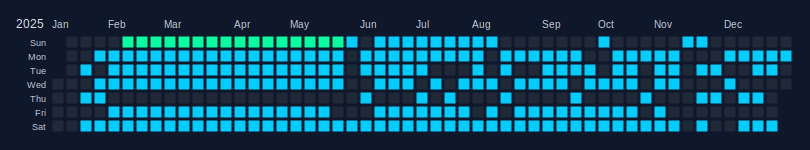

# Workout -> GitHub Heatmap

Sync Strava activities, normalize and aggregate them, and generate GitHub-style calendar heatmaps (SVG) per workout type/year. A single preview is shown in this README, with the full interactive view on GitHub Pages.

- Live site: [Interactive Heatmaps](https://aspain.github.io/git-sweaty/)
- For forks, this link is auto-updated to your own GitHub Pages URL after your first successful sync run.

<!-- HEATMAPS:START -->
Preview:


<!-- HEATMAPS:END -->

## Strava App Setup

Create a Strava API application at [Strava API Settings](https://www.strava.com/settings/api). Use `localhost` for the **Authorization Callback Domain**.
After creating the app, copy only:
- `STRAVA_CLIENT_ID`
- `STRAVA_CLIENT_SECRET`

Do not copy a refresh token from the Strava app page; you will generate `STRAVA_REFRESH_TOKEN` in the next step.

## Quick start (GitHub Actions only)

Forking the repo is enough for this setup; no local clone is required. You can run everything from GitHub Actions. Clone locally only if you want to customize or run the scripts yourself.

1. Generate a **refresh token** via OAuth (the token shown on the Strava API page often does **not** work):

Open this URL in your browser (replace `CLIENT_ID`):

```
https://www.strava.com/oauth/authorize?client_id=CLIENT_ID&response_type=code&redirect_uri=http://localhost/exchange_token&approval_prompt=force&scope=read,activity:read_all
```

After approval you’ll be redirected to a `localhost` URL that won’t load. That’s expected. Copy the `code` from the URL and exchange it:

```bash
curl -X POST https://www.strava.com/oauth/token \
  -d client_id=CLIENT_ID \
  -d client_secret=CLIENT_SECRET \
  -d code=THE_CODE_FROM_THE_URL \
  -d grant_type=authorization_code
```

Copy the `refresh_token` from the response.

2. Add GitHub secrets (repo → Settings → Secrets and variables → Actions):
- `STRAVA_CLIENT_ID`
- `STRAVA_CLIENT_SECRET`
- `STRAVA_REFRESH_TOKEN` (from the OAuth exchange above)

3. Run the workflow:
If GitHub shows an **Enable workflows** button in the Actions tab, click it first.
Go to **Actions → Sync Strava Heatmaps → Run workflow**.
The same workflow is also scheduled in `.github/workflows/sync.yml` (daily at `06:00 UTC`).

This will:
- sync raw activities into `activities/raw/` (local-only; not committed)
- normalize + merge into `data/activities_normalized.json` (persisted history)
- aggregate into `data/daily_aggregates.json`
- generate SVGs in `heatmaps/`
- build `site/data.json`

## GitHub Pages setup

1. Go to **Settings → Pages**.
2. Under **Build and deployment**, set **Source** to **GitHub Actions**.
3. Run the workflow once from the top GitHub navigation: **Actions** (not **Settings → Actions**) → **Sync Strava Heatmaps** → **Run workflow**. The **Deploy Pages** workflow will publish `site/` automatically.
4. Your site will be available at `https://<your-username>.github.io/<repo-name>/` once the deploy finishes.

## Configuration

Base settings live in `config.yaml`.

Key options:
- `sync.start_date` (default `2019-01-01`; currently set and overrides `sync.lookback_years`)
- `sync.lookback_years` (default 5; used only when `sync.start_date` is unset)
- `sync.recent_days` (sync recent activities even while backfilling)
- `sync.resume_backfill` (persist cursor to continue older pages across days)
- `activities.types` (featured activity types shown first in UI)
- `activities.include_all_types` (include non-featured Strava types; default `false`)
- `activities.group_other_types` (auto-group non-featured types into smart categories)
- `activities.other_bucket` (fallback group name when no smart match is found)
- `activities.group_aliases` (optional explicit map of a raw/canonical type to a group)
- `activities.type_aliases` (map Strava types to your canonical types before grouping)
- `units.distance` (`mi` or `km`)
- `units.elevation` (`ft` or `m`)
- `rate_limits.*` (free Strava API throttling caps)

## Notes

- Raw activities are stored locally for processing but are not committed (`activities/raw/` is ignored). This prevents publishing detailed per‑activity payloads and gps location traces.
- On first run for a new athlete, the workflow auto-resets persisted outputs (`data/*.json`, `heatmaps/`, `site/data.json`) to avoid mixing data across forks. A fingerprint-only file is stored at `data/athletes.json` and does not include athlete IDs or profile data.
- The sync script rate-limits to free Strava API caps (200 overall / 15 min, 2,000 overall daily; 100 read / 15 min, 1,000 read daily). The cursor is stored in `data/backfill_state.json` and resumes automatically. Once backfill is complete, only the recent sync runs.
- The GitHub Pages site is optimized for responsive desktop/mobile viewing.
